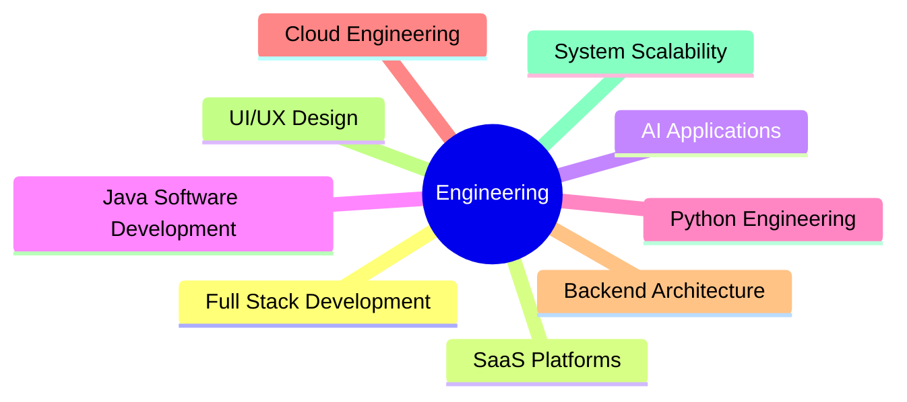

<div align="center">

# 🚀 ISURU CHANDIKA

### Full Stack Developer • Software Engineer • SaaS Builder • Cloud Engineering Learner


<br/>


</div>

---

# 💫 About Me

```yaml
Name: Isuru Chandika
Role: Full Stack Developer & Software Engineer
Location: Sri Lanka
Focus: SaaS Applications, AI Solutions & Modern Web Apps
Learning: Cloud Engineering & Scalable System Design
Passion: Creating High Quality Digital Experiences
```

<br/>

- 💻 Building modern full stack web & software applications
- 🚀 Creating scalable SaaS platforms and business solutions
- 🤖 Exploring AI-powered applications and intelligent systems
- ☁️ Cloud Engineering learner focused on scalable infrastructure
- ⚡ Passionate about performance, scalability, and clean architecture
- 🎨 Designing premium modern UI/UX experiences
- 🧠 Continuously learning and improving engineering skills
- 📫 Reach me: **isuruchandika321@gmail.com**

---

# 🌐 Connect With Me

<div align="center">

<a href="https://github.com/isuruchandikarathnayaka">
  
</a>

<a href="https://linkedin.com">
  
</a>

<a href="https://instagram.com">
  
</a>

<a href="https://facebook.com">
  
</a>

</div>

---

# ⚒️ Tech Stack

<div align="center">

## 🌐 Frontend Development


<br/><br/>

## ⚙️ Backend & Software Development


<br/><br/>

## 🤖 AI & Emerging Technologies


<br/><br/>

## 🗄️ Databases & Cloud


<br/><br/>

## ☁️ DevOps & Cloud Learning


<br/><br/>

## 🎨 Design & Tools


</div>

---

# 🚀 What I Build

<div align="center">

| 💻 Software Applications | 🌐 SaaS Platforms | 🤖 AI Solutions | ⚡ Backend Systems |
|---|---|---|---|
| Java & Python Apps | Scalable Business Platforms | AI Integrated Features | APIs & Microservices |

</div>

<br/>

<div align="center">

| 🎨 Premium UI/UX | ☁️ Cloud Learning | 📱 Responsive Apps | 🔒 Secure Systems |
|---|---|---|---|
| Modern Interfaces | Infrastructure Concepts | Mobile Friendly | Clean Architecture |

</div>

---

# 📊 GitHub Analytics

<div align="center">


</div>

<br/>

<div align="center">


</div>

---

# 📈 Contribution Activity

<div align="center">


</div>

---

# 🏆 GitHub Achievements

<div align="center">


</div>

---

# 🎯 Current Focus

```txt
✔ Building Modern SaaS Applications
✔ Creating AI Powered Software Solutions
✔ Developing Scalable Backend Systems
✔ Improving Cloud Engineering Knowledge
✔ Contributing to Modern Software Development
✔ Designing Premium User Experiences
```

---

# 💡 Engineering Interests

<div align="center">



</div>

---

<div align="center">

## 💬 Developer Quote

> "Software is not just about writing code — it's about solving real problems with creativity and engineering."

</div>

---

<div align="center">

# ⭐ Thanks for visiting my profile!

### 🚀 Open to collaborations, freelance projects, and innovative ideas.

</div>
